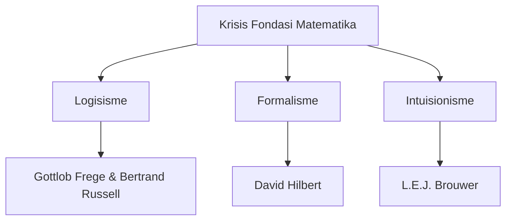

 
# Filsafat Matematika: Sejarah, Tokoh, Teori, dan Konflik Fondasional

Filsafat matematika adalah cabang filsafat yang bertujuan untuk memeriksa landasan, status ontologis, epistemologi, serta metodologi matematika. Pada dasarnya, disiplin ini tidak berfokus pada bagaimana melakukan perhitungan matematika, melainkan pada *apa arti dari hasil matematika* dan *bagaimana kebenarannya dapat dijamin*.

Terdapat tiga pertanyaan mendasar yang selalu membayangi praktik matematika sepanjang sejarahnya:
1. **Apakah entitas matematis ada secara objektif** di luar diri kita, bahkan di luar dunia fisik? (Pertanyaan Ontologis)
2. **Bagaimana kita bisa mengetahui** keberadaan atau memperoleh pengertian dari objek-objek matematis tersebut? (Pertanyaan Epistemologis)
3. **Bagaimana kita menjamin bahwa pengetahuan tentangnya benar atau salah secara mutlak**, bukan sekadar karena kesepakatan sosial? Ini berkaitan erat dengan semantik atau makna dari proposisi-proposisi matematis.

---

## A. Sejarah Perkembangan: Realisme vs. Nominalisme

Dalam bentuknya yang paling klasik, perdebatan filsafat matematika berpusat pada status eksistensi objek matematis. Perdebatan ini membelah pemikir menjadi dua kubu besar: **Realisme (Platonisme)** dan **Nominalisme (Anti-Realisme)**.

### 1. Realisme (Platonisme)
Realisme matematis adalah kepercayaan bahwa objek-objek matematis—seperti bilangan, himpunan, dan bangun geometri—memiliki eksistensi objektif yang riil dan mandiri di luar pikiran manusia serta dunia fisik. 
* **Konsep Utama:** Kaum realis mengasumsikan adanya "ranah abstrak" (sering disebut Surga Plato) di mana entitas matematika ada secara abadi, tidak terikat ruang dan waktu, serta secara kausal bersifat inert (tidak memancarkan energi atau berinteraksi secara fisik).
* **Tokoh Klasik:** **Pythagoras** (yang meyakini bahwa esensi dari seluruh alam semesta adalah bilangan) dan **Plato** (yang mengajukan bahwa objek fisik di dunia indrawi hanyalah bayangan tidak sempurna dari *Forma* ideal yang abstrak, termasuk objek-objek matematika).

### 2. Nominalisme
Nominalisme muncul sebagai reaksi langsung terhadap realisme abstrak. Pandangan ini berkembang pesat pada abad ke-13 (khususnya melalui pemikiran William of Ockham) dan menyatakan bahwa objek-objek abstrak itu tidak nyata.
* **Konsep Utama:** Bilangan dan konsep matematis lainnya hanyalah nama (*nomina*) atau kategori linguistik yang diciptakan oleh manusia untuk membantu mengelompokkan objek-objek konkret di dunia fisik. Bilangan $3$, misalnya, tidak ada di luar sana; yang ada hanyalah tiga buah apel konkret, tiga buah batu konkret, dan seterusnya. Pikiran manusialah yang mengabstraksikannya menjadi konsep "tiga".
* **Karakteristik:** Nominalisme sering dikategorikan sebagai anti-realisme karena menolak klaim bahwa matematika merujuk pada dunia objektif yang non-fisik.

---

## B. Perkembangan Pada Era Modern: Kronecker vs. Dedekind

Pada abad ke-19, fokus perdebatan bergeser dari metafisika murni (apakah bilangan itu ada) ke arah landasan epistemologis dan metodologis (bagaimana kita membangun sistem matematika yang kokoh). Dua tokoh Jerman memelopori percabangan besar ini:

### 1. Leopold Kronecker (1823–1891): Kubu Intuisi
Kronecker meyakini bahwa matematika harus didasarkan pada intuisi manusia yang bersumber langsung dari pengalaman membilang objek konkret di dunia nyata. 
* **Teori:** Bagi Kronecker, satu-satunya landasan matematika yang sah adalah bilangan asli (bilangan bulat positif) karena diperoleh secara intuitif dari laku menghitung objek secara konkret. Ia terkenal dengan pernyataannya:
  > *"Die ganzen Zahlen hat der liebe Gott gemacht, alles andere ist Menschenwerk."*  
  > (Tuhan menciptakan bilangan bulat asli, sisanya adalah hasil kerja manusia.)
* **Implikasi:** Semua entitas matematika yang lebih kompleks (seperti bilangan irasional, bilangan kompleks, dan konsep tak terhingga aktual) harus dapat direduksi menjadi operasi bilangan asli secara finitistik (terbatas). Jika tidak bisa direduksi, maka entitas tersebut dianggap fiktif atau tidak valid. Pandangan Kronecker ini kelak melahirkan mazhab **Intuisionisme**.

### 2. Richard Dedekind (1831–1916): Kubu Logika
Berseberangan dengan Kronecker, Dedekind memandang bahwa matematika adalah produk pemikiran logis murni, bukan sekadar intuisi empiris.
* **Teori:** Dedekind menunjukkan bahwa konsep-konsep matematika yang dianggap intuitif (seperti kontinuitas garis dan bilangan real) dapat didefinisikan secara ketat melalui struktur logika formal tanpa memerlukan representasi geometris atau visual. Metode terkenalnya, **Potongan Dedekind** (*Dedekind Cut*), mendefinisikan bilangan irasional secara logis menggunakan partisi dari himpunan bilangan rasional.
* **Implikasi:** Keseluruhan operasi matematika dapat dialihfungsikan menggunakan operasi logis terstruktur. Hal ini menginspirasi gerakan untuk mengaitkan matematika sepenuhnya dengan logika, yang kelak melahirkan mazhab **Logisisme**.

---

## C. Teori-Teori Besar dan Tokoh-Tokoh Utamanya

Dialektika antara kubu Kronecker dan Dedekind memuncak pada awal abad ke-20 menjadi **Krisis Fondasi Matematika** (*Foundational Crisis of Mathematics*). Dari krisis ini lahir tiga mazhab utama filsafat matematika modern:

### 1. Logisisme (Frege dan Russell)
Logisisme adalah klaim bahwa matematika (khususnya aritmetika) dapat direduksi seluruhnya menjadi logika murni. Proposisi matematis pada dasarnya adalah proposisi logis yang sangat kompleks.

* **Gottlob Frege (1848–1925):** 
  Frege berusaha membangun sistem logika formal (dalam karyanya *Begriffsschrift* dan *Grundgesetze der Arithmetik*) untuk mendefinisikan bilangan asli menggunakan hukum-hukum dasar logika universal. Bagi Frege, angka $2$ adalah "himpunan dari semua konsep yang memiliki tepat dua anggota". Keberadaan bilangan dijamin secara objektif oleh validitas hukum logika.
  
* **Bertrand Russell (1872–1970) & Alfred North Whitehead (1861–1947):**
  Setelah Frege hampir menyelesaikan proyeknya, Russell menemukan cacat fatal dalam sistem Frege yang dikenal sebagai **Paradoks Russell** (lihat bagian Konflik). Untuk menyelamatkan proyek logisisme, Russell dan Whitehead menulis *Principia Mathematica* (1910–1913). Mereka memperkenalkan **Teori Tipe** (*Theory of Types*) untuk menghindari kontradiksi teori himpunan dengan membagi objek-objek matematis ke dalam hierarki tingkat (tipe), di mana suatu himpunan hanya dapat memuat objek dari tipe yang lebih rendah darinya.

### 2. Intuisionisme (L.E.J. Brouwer)
Intuisionisme adalah pandangan anti-realis radikal yang menyatakan bahwa matematika adalah aktivitas mental konstruktif manusia, bukan penemuan fakta objektif di luar diri kita.

* **Luitzen Egbertus Jan Brouwer (1881–1966):**
  Brouwer menolak pandangan logisisme maupun platonisme. Baginya, matematika lahir dari intuisi dasar manusia mengenai waktu—aliran momen-momen yang terbagi, yang memungkinkan kita mengonstruksi konsep bilangan $1$, lalu $2$ (setelah $1$), dan seterusnya.
* **Penolakan Tak Terhingga Aktual:**
  Brouwer menyatakan bahwa kita tidak boleh memperlakukan "tak terhingga" sebagai sesuatu yang sudah selesai atau ada secara aktual (*actual infinity*). Tak terhingga hanya bersifat potensial (*potential infinity*), yaitu proses konstruksi yang terus-menerus tanpa akhir.
* **Penolakan Hukum Penolakan Jalan Tengah (LEM):**
  Karena matematika adalah konstruksi mental aktif, suatu pernyataan matematika baru dianggap benar jika kita telah mengonstruksi buktinya secara eksplisit. Akibatnya, Brouwer menolak **Hukum Penolakan Jalan Tengah** (law of excluded middle: $P \lor \neg P$) untuk domain tak terbatas. Bagi intuisionis, kita tidak bisa mengasumsikan bahwa pernyataan "Ada bilangan dengan sifat $X$" adalah benar atau salah sebelum kita benar-benar membangun (mengonstruksi) bilangan tersebut atau membuktikan kontradiksinya secara langsung.

### 3. Formalisme (David Hilbert)
Formalisme memandang matematika sebagai permainan manipulasi simbol formal di atas kertas berdasarkan aturan main sintaksis tertentu yang disepakati, mirip seperti permainan catur.

* **David Hilbert (1862–1943):**
  Hilbert ingin menyelamatkan matematika klasik yang indah (termasuk teori himpunan Cantor dan matematika tak terhingga) dari "serangan destruktif" kaum intuisionis yang ingin membuang sebagian besar teorema matematika penting karena dianggap non-konstruktif.
* **Program Hilbert:**
  Hilbert mengusulkan agar seluruh matematika diformalisasikan ke dalam sistem aksioma simbolik yang ketat tanpa makna intrinsik. Setelah diformalkan, kita harus membuktikan secara matematis bahwa sistem aksioma tersebut **konsisten** (tidak akan pernah menghasilkan kontradiksi seperti $0 = 1$) dan **lengkap** (setiap pernyataan matematika yang dapat dirumuskan dalam sistem tersebut dapat dibuktikan benar atau salah). Hilbert percaya metode pembuktian konsistensi ini harus menggunakan metode finitistik konkret yang dapat diterima oleh kaum intuisionis sekalipun.

---

## D. Konflik-Konflik Fondasional yang Mendominasi Praktik Matematika

Praktik matematika tidak berjalan dalam harmoni yang sunyi, melainkan diwarnai oleh konflik-konflik mendalam mengenai apa yang menjamin suatu kebenaran matematis benar atau salah. Berikut adalah konflik-konflik terbesar yang membentuk sejarah matematika:

### 1. Konflik Ketakterhinggaan: Cantor vs. Kronecker
Konflik ini meletus ketika **Georg Cantor** (1845–1918) mencetuskan Teori Himpunan dan menunjukkan bahwa konsep ketakterhinggaan dapat diperlakukan secara matematis sebagai objek aktual (*actual infinity*), bukan sekadar potensial.

* **Teori Cantor:**
  Cantor merumuskan teori tentang ketakterbilangan bilangan real (*Indenumerability of the Reals* / *Uncountability of the Reals*) menggunakan **Argumentasi Diagonal Cantor** (*Cantor's Diagonal Argument*). 
  
  *Bukti Sederhana Diagonalisasi Cantor:*
  Misalkan kita berasumsi semua bilangan real di antara $0$ dan $1$ dapat didaftar (korespondensi satu-satu dengan bilangan asli $\mathbb{N}$). Kita tulis daftar tersebut dalam representasi desimalnya:
  
  $$r_1 = 0.\mathbf{d_{11}}d_{12}d_{13}\dots$$
  $$r_2 = 0.d_{21}\mathbf{d_{22}}d_{23}\dots$$
  $$r_3 = 0.d_{31}d_{32}\mathbf{d_{33}}\dots$$
  
  Cantor mengonstruksi bilangan real baru $d = 0.e_1e_2e_3\dots$ di mana digit ke-$i$ didefinisikan sebagai:
  
  $$e_i = \begin{cases} 1 & \text{jika } d_{ii} \neq 1 \\ 2 & \text{jika } d_{ii} = 1 \end{cases}$$
  
  Bilangan $d$ ini jelas berbeda dari $r_1$ pada digit pertama, berbeda dari $r_2$ pada digit kedua, dan secara umum berbeda dari $r_i$ pada digit ke-$i$. Oleh karena itu, $d$ tidak ada di dalam daftar asli. Ini membuktikan kontradiksi bahwa daftar tersebut lengkap. Bilangan real terbukti tidak terbilang dan memiliki ukuran tak terhingga ($\aleph_1$) yang lebih besar dari tak terhingga bilangan asli ($\aleph_0$).
  
* **Konflik:**
  Leopold Kronecker menyerang Cantor dengan sangat kejam. Ia menganggap teori Cantor sebagai kegilaan metafisis dan "penipuan" ilmiah. Kronecker menggunakan pengaruhnya di jurnal-jurnal ilmiah untuk menjegal publikasi karya Cantor dan menghalangi posisi akademisnya. Penolakan keras ini memicu depresi berat berkepanjangan pada Cantor, yang menghabiskan akhir hidupnya di sanatorium mental. Konflik ini menyoroti perdebatan abadi: *Apakah tak terhingga aktual adalah objek riil yang sah atau hanya ilusi linguistik?*

### 2. Paradoks Russell: Runtuhnya Logika Fondasional Frege
Konflik ini terjadi pada tahun 1902 ketika Bertrand Russell menulis surat legendaris kepada Gottlob Frege yang saat itu sedang mencetak volume kedua dari karya agungnya, *Grundgesetze der Arithmetik*.

* **Paradoks:**
  Frege menggunakan aksioma abstraksi tanpa batas yang menyatakan bahwa sifat apa pun dapat mendefinisikan suatu himpunan yang sah. Russell mengajukan pertanyaan:
  > *"Misalkan $R$ adalah himpunan dari semua himpunan yang tidak memuat dirinya sendiri sebagai anggota ($R = \{x \mid x \notin x\}$). Apakah $R$ merupakan anggota dari dirinya sendiri?"*
  
  * **Jika $R \in R$:** Berdasarkan definisi himpunan $R$, ia tidak boleh memuat dirinya sendiri, sehingga $R \notin R$. (Kontradiksi)
  * **Jika $R \notin R$:** Maka $R$ memenuhi syarat untuk masuk ke dalam himpunan $R$, sehingga $R \in R$. (Kontradiksi)
  
* **Dampak:**
  Kontradiksi logis murni ini meruntuhkan fondasi sistem Frege. Frege terpaksa menambahkan lampiran darurat pada bukunya yang berbunyi: 
  > *"Seorang ilmuwan hampir tidak bisa menghadapi sesuatu yang lebih tidak diinginkan selain mendapati fondasi karyanya runtuh saat pekerjaan itu hampir selesai."*
  
  Konflik ini memicu perdebatan: *Bagaimana kita membatasi definisi objek matematika agar terhindar dari paradoks logika yang merusak konsistensi?*

### 3. Perang Katak dan Tikus (*Frog and Mouse War*): Hilbert vs. Brouwer
Perseteruan antara David Hilbert (Formalisme) dan L.E.J. Brouwer (Intuisionisme) pada tahun 1920-an adalah pertempuran perebutan kekuasaan intelektual terbesar dalam sejarah matematika. Albert Einstein menyebutnya sebagai *Frosch-Mäuse-Krieg* (perang katak dan tikus) karena betapa sengit dan personalnya konflik tersebut.

* **Substansi Perdebatan:**
  Brouwer ingin melarang penggunaan Hukum Penolakan Jalan Tengah ($P \lor \neg P$) dan metode pembuktian kontradiksi non-konstruktif dalam matematika tak terhingga. Hilbert berang, karena ini berarti membuang sebagian besar matematika analisis dan geometri klasik yang berharga. Hilbert terkenal dengan bantahannya:
  > *"Merebut Hukum Penolakan Jalan Tengah dari tangan matematikawan sama saja dengan melarang astronom menggunakan teleskop atau petinju menggunakan sarung tinju."*
* **Klimaks Konflik:**
  Ketegangan memuncak ketika Hilbert menggunakan pengaruhnya untuk memecat Brouwer dari dewan redaksi *Mathematische Annalen* (jurnal matematika paling bergengsi saat itu) pada tahun 1928. Langkah ini memecah komunitas matematika Eropa menjadi dua kubu yang saling bermusuhan.

### 4. Teorema Ketidaklengkapan Gödel (1931): Runtuhnya Impian Formalisme
Di tengah perdebatan sengit antara kaum formalis dan intuisionis, seorang logikawan muda berusia 25 tahun bernama **Kurt Gödel** mempublikasikan dua teorema matematika yang mengubah jalannya sejarah filsafat selamanya.

* **Teorema Pertama Ketidaklengkapan:**
  Setiap sistem formal aksiomatis yang konsisten dan cukup kuat untuk mengekspresikan aritmetika dasar selalu memuat pernyataan-pernyataan yang *benar secara matematis* tetapi tidak akan pernah bisa dibuktikan maupun disangkal dari dalam sistem tersebut (*undecidable*).
* **Teorema Kedua Ketidaklengkapan:**
  Konsistensi dari sistem formal aksiomatis tersebut tidak dapat dibuktikan dengan menggunakan metode yang ada di dalam sistem itu sendiri.
* **Dampak Praktis dan Filosofis:**
  Teorema Gödel membuktikan secara matematis bahwa impian Program Hilbert untuk memformalkan seluruh matematika dan membuktikan konsistensinya adalah hal yang mustahil secara logis. Matematika tidak akan pernah bisa direduksi menjadi sistem permainan simbol yang tertutup dan mandiri. Selalu ada kebenaran matematis yang melampaui pembuktian formal formalisme.

### 5. Dilema Benacerraf (1973)
Filsuf Paul Benacerraf merumuskan dilema epistemologis-semantis yang menunjukkan ketidakselarasan antara cara kita memaknai bahasa matematika dengan cara kita memperoleh pengetahuan.

* **Sisi Semantik (Mendukung Platonisme):** Kalimat matematika seperti "$2 + 3 = 5$" harus memiliki struktur semantik yang sama dengan kalimat bahasa sehari-hari seperti "Jakarta + Bandung = dua kota". Ini berarti bilangan harus ada secara objektif agar proposisi matematika bernilai benar secara harfiah.
* **Sisi Epistemik (Mendukung Nominalisme):** Teori pengetahuan ilmiah menyatakan bahwa kita hanya bisa mengetahui keberadaan suatu objek jika ada hubungan kausal antara subjek dengan objek tersebut. Namun, jika bilangan adalah objek abstrak yang ada di luar ruang, waktu, dan kausalitas (Platonisme), maka mustahil bagi pikiran manusia untuk berinteraksi dengannya atau mengetahuinya.
* **Kontradiksi Utama:** 
  Jika kita menerima Platonisme untuk menyelamatkan kebenaran semantik matematika, kita mengorbankan kemungkinan epistemologi (bagaimana kita bisa tahu?). Jika kita menerima Nominalisme untuk menyelamatkan epistemologi, kita mengorbankan semantik (matematika hanyalah fiksi kosong).

---

## E. Matriks Perbandingan Mazhab Fondasi Matematika

| Dimensi Perdebatan | Logisisme (Frege/Russell) | Formalisme (Hilbert) | Intuisionisme (Brouwer) | Platonisme Radikal (Gödel) |
| :--- | :--- | :--- | :--- | :--- |
| **Status Ontologis Bilangan** | Objek logis universal yang ada secara objektif. | Hanya simbol atau tanda di atas kertas tanpa arti metafisis. | Konstruksi mental yang aktif di dalam pikiran manusia. | Objek abstrak mandiri yang ada di luar ruang dan waktu. |
| **Penentu Kebenaran** | Validitas hukum-hukum logika. | Konsistensi sintaksis sistem aksioma. | Keterbuktian konstruktif langkah-demi-langkah. | Intuisi matematika yang analog dengan persepsi indrawi. |
| **Sikap Terhadap Tak Terhingga** | Menerima tak terhingga aktual melalui logika kelas. | Menerima tak terhingga aktual sebagai simbol ideal yang berguna. | Menolak tak terhingga aktual; hanya menerima tak terhingga potensial. | Menerima tak terhingga aktual sebagai realitas objektif. |
| **Hukum Penolakan Jalan Tengah ($P \lor \neg P$)** | Berlaku penuh. | Berlaku penuh. | Ditolak untuk objek tak terhingga. | Berlaku penuh. |
| **Sebab Runtuh / Kelemahan** | Terbentur Paradoks Russell dan kebutuhan akan aksioma non-logis (aksioma tak hingga). | Dihancurkan oleh Teorema Ketidaklengkapan Gödel (1931). | Membuang sebagian besar cabang matematika klasik yang penting bagi sains. | Mengalami kesulitan menjelaskan interaksi kausal (Dilema Benacerraf). |

---

## Kesimpulan

Konflik-konflik fondasional di atas membuktikan bahwa matematika bukanlah struktur kebenaran monolitik yang bebas dari keraguan. Setiap klaim kebenaran matematis—apakah itu benar karena konsistensi logis, karena konstruksi pikiran, atau karena eksistensi abadi objeknya—selalu berdiri di atas landasan filosofis tertentu. Di balik setiap rumus matematika yang kita gunakan hari ini, terdapat perdebatan metafisis dan epistemologis mendalam yang mendefinisikan batas pemahaman dan pencarian manusia akan kebenaran mutlak.